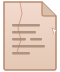
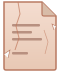
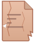
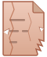
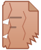
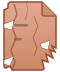

# Document Degradation Icon Progression

| Interaction | Icon | Color | Damage | Text Lines |
|:-----------:|:----:|:-----:|:------:|:----------:|
| 0  |  | Clean white/blue | None | 5/5 |
| 2  |  | Barely warm | None | 5/5 |
| 4  |  | Light warm | Hairline crack | 5/5 |
| 6  |  | Warm | Faint crack | 5/5 |
| 8  |  | Orange-warm | Crack + chip | 4.5/5 |
| 10 |  | Clear orange | Crack + chip | 4/5 |
| 12 |  | Red-orange | 2 cracks + chips | 3/5 |
| 14 |  | Red | Cracks + torn edge | 2.5/5 |
| 16 |  | Deep red | Heavy cracks + tears | 2/5 |
| 18 |  | Darker red | Both edges torn | 1.5/5 |
| 20 |  | Darkest red | Major tears + chunks | 1/5 |
