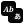

# Domain Icons (Black)

| | | | | |
|---|---|---|---|---|
|  accounting |  audiosyn |  aviation |  calendar |  chess |
|  circuit |  crystal |  dbschema |  dns |  docker |
|  earncall |  edifact |  emails |  fiction |  filesystem |
|  fonteng |  foodmenu |  genealogy |  geodata |  geotrack |
|  graphviz |  hamradio |  infra |  jobboard |  json |
|  landmarks |  latex |  libcatalog |  makefile |  malware |
|  mathlean |  molecule |  musicsheet |  obj3d |  playlist |
|  protein |  python |  quantum |  recipe |  robotics |
|  satellite |  screenplay |  slides |  spreadsheet |  starcatalog |
|  subtitles |  transit |  translation |  treebank |  vector |
|  weather |  weaving | | | |
